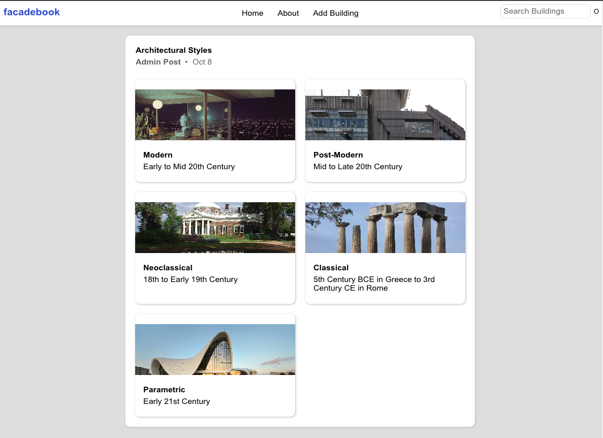
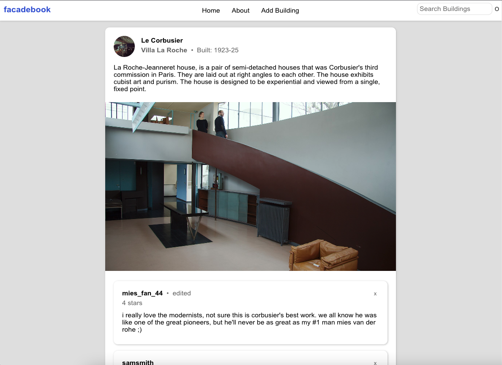
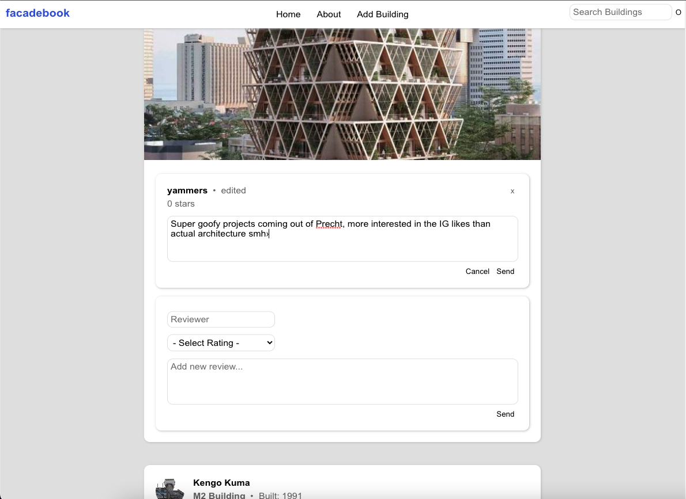

# FacadeBook

## Date: 10/20/2022

### Author: Amaya Lucas

### Deployed Page: [Facadebook](https://facadebook.herokuapp.com/)

---

#### [Trello](https://trello.com/b/BegZayn6/facadebook) || [GitHub](https://github.com/ajluc) | [LinkedIn](https://www.linkedin.com/in/amaya-lucas/)

---

### **_Description_**

An anonymous, open source architecture blog where contributors can give their unfiltered opinions of the built environment. The field of architecture is inherently critical. For decades, the field has been dominated by powerful and already-established voices. Facadebook is an interactive social platform to open the dialogue to all fans (and haters) of architecture.

Reviews are posted under pseudonyms, and anyone in the community can add a new building to be reviewed. A fun feature (bug?) is the ability to edit anyone's reviews and twist their words however you'd like! When I learn encription that may change.

---

### **_Technologies Used_**

1. MongoDB
2. React.js
3. Express
4. Javascript
5. HTML
6. CSS

---

### **_Getting Started_**

At the top of the home feed, there is a post containing several architectural styles. Clicking one navigates the user to all the building cards within that style, which can be clicked for more info. Alternatively, all buildings are posted chronologically in the feed beneath styles. On the building posts, users can leave comments under a pseudonym with a star rating. Comments can be edited by any user so as to co-opt the traditional review process, allowing for chaos and twisting of words. It will however display an "edited" identifier for transparency. If they really disagree with a particular review, a user can delete it with the "x" in the upper right corner.

In the navigation bar at the top of the page, users can return home, read the "about" section, add a new building, or search for a building (functionality coming soon!).

---

### **_Screenshots_**

Styles post:

Building post:

Editing a review:

---

### **_Tasks_**

- [x] Add all buildings to home page feed
- [ ] Search bar functionality
- [ ] Add new building post at top of feed
- [ ] Create "likes" on building details
- [ ] Icons and font in nav bar
- [ ] Blue as highlight color for buttons
- [ ] Deploy the project

---

### **_Credits_**

Drop-Shadow: [Mozilla](https://developer.mozilla.org/en-US/docs/Web/CSS/filter-function/drop-shadow)

Hidden Scrollbar: [W3Schools](https://www.w3schools.com/howto/howto_css_hide_scrollbars.asp)

Title: A million thank-you's to Andy Garcia for the project name.
